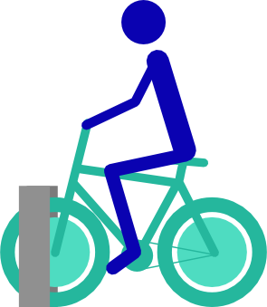

This App has for goal to predict whether at least one bike would be present at each New York city City Bike station at a given time (per 10 min bin). It is more to check if there one has a good chance to find a bike in a couple of hours or the day after than for immediate use. For immediate use, it is better to check this [app](http://glimmer.rstudio.com/ramnathv/BikeShare/) that gives the number of bikes in each station in real time.

## Navigation

To use this App:
* click on the Map navigation button
* Select a date, an hour and time range during this hour (for example  10 between 10 and 30 aka 10:10 to 10:30 AM) you would like to pick up a bike
* Each marker indicate a bike station
* In all the station in green there would be likely at least one bike at the desired day and time if it's red.

## Data pre-processing and model

City Bike data were downloaded from the City Bike [website](http://www.citibikenyc.com/system-data) in csv format in February 2014. These data set is divided in 18 csv, one for each month from July 2013 to December 2014.
The data were processed in R, the full code is in github [here](https://github.com/slardeux/cityBike); the code for this app is [here](https://github.com/slardeux/citybike-app). Briefly the time a bike stayed docked at a station was extracted and binned in  10 minute bin for each day of the week. One model has been created for each month of the year.
After extraction, a boosted tree model (gbm) was run to try to predict whether at least a bike would be present at a given station.
Th accuracy of the model is relatively good, however, it is a lot more accurate to predict that at least a bike would be present than to predict there would be no bikes.

## Acknowledgement

Thanks to the package leaflet shiny build by [JCheng](https://github.com/jcheng5/leaflet-shiny/tree/master/).

